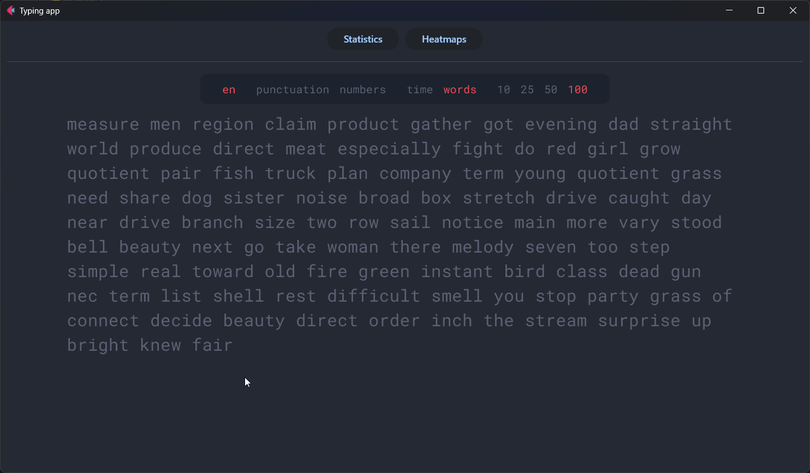
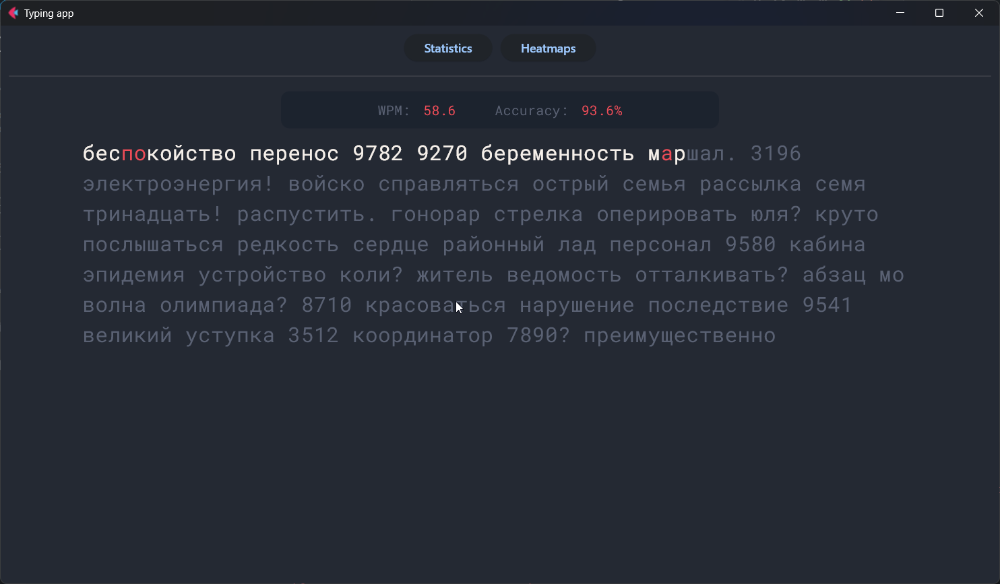

# Typing app


The Typing Trainer App, inspired by [MonkeyType](https://monkeytype.com/), helps users improve their typing speed and accuracy. Users can customize their training mode by choosing the language, punctuation, numbers, and text size. Detailed statistics are provided to track progress and identify areas for improvement.

## Demo

This is the main interface where you can set up your typing test. Customize the language, punctuation, numbers, and text size according to your preferences.



Here's the app during a typing test. Your current speed and accuracy are displayed as you type.



After completing the test, you will be able to view statistics for all your tests to track your progress.

## Getting started

### Installation

```bash
pip install -r requirements.txt
```

(working on Python 3.10, maybe on other versions too)

### Launch

```bash
python main.py
```
